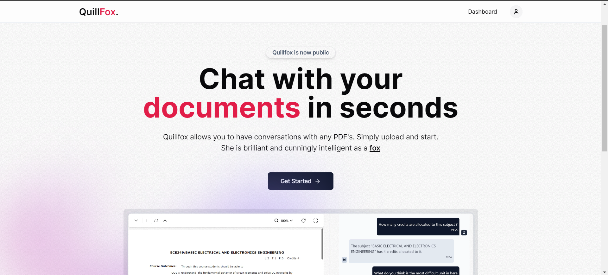
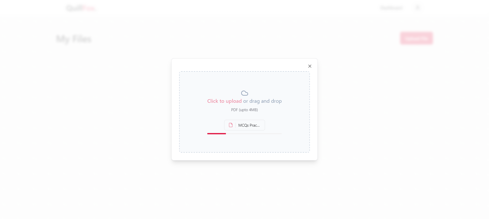
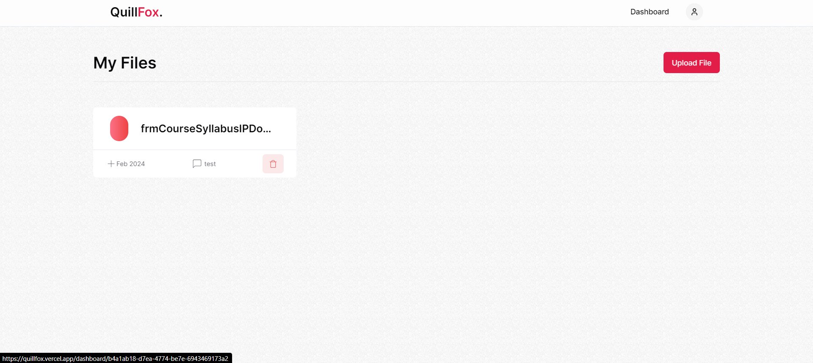
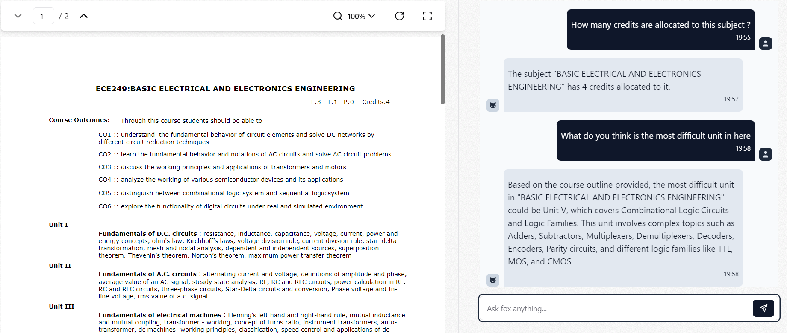
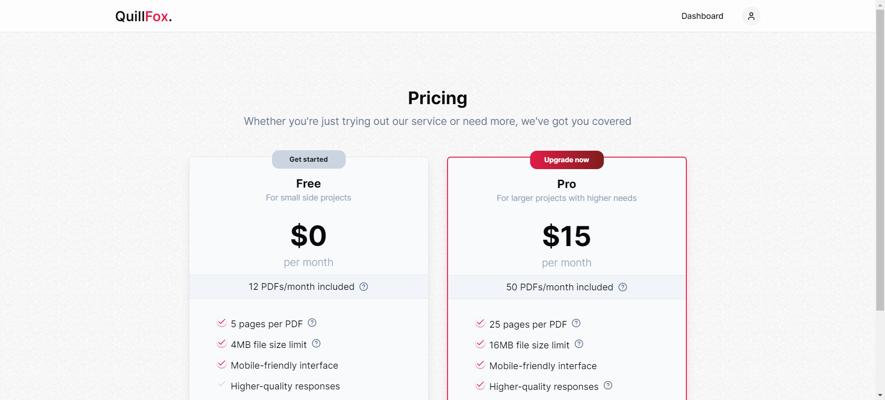

## What is quillfox?
Quillfox allows you to have conversations with any PDF's. Simply upload and start asking your questions. She is brilliant and cunningly intelligent as a fox.

###### Tech stack: 
Nextjs 14, tRPC, Prisma, Kinde auth, openAI api, pinecone vector database, langchain.

Tailwindcss, shadCN ui, Stripe, Uploadthing, tanstack query

<hr>

`Live link:` [https://quillfox.vercel.app/](https://quillfox.vercel.app/){:target="_blank"}

<font size="1">Please note that if fox (chat) is not giving any response, it means I am out of openai credits. :( </font>

In that case here are few previews of what it actually looks like:

## It's very simple

#### 1. Sign up 

#### 2. Upload your PDF 

#### 3. Access it from the dashboard 

#### 4. Start asking questions

#### 5. If you need to interact with larger files upgrade to pro plan. 
<font size="1">Right now I have just removed the pro feature gate. So you can upload files of any size (Just for DEMO purpose).</font>



</br>

## Installation

First clone this repository. You can also fork this repository and then clone the forked one.

```ts
git clone https://github.com/Mvishal123/quillfox.git
```

Make sure you have Node Package Manager (npm) installed. Will work with most versions, but the latest (LTS) is recommended.

Now you need to install all the dependencies.

```ts
cd quillfox
npm install
```

You are done with the installation.

To run the website, use the following command
```ts
npm run dev
```
- The website will be live at https://localhost:3000

## Contributions are always welcomed. 
- Raise issues
- Make changes and make a PR.


